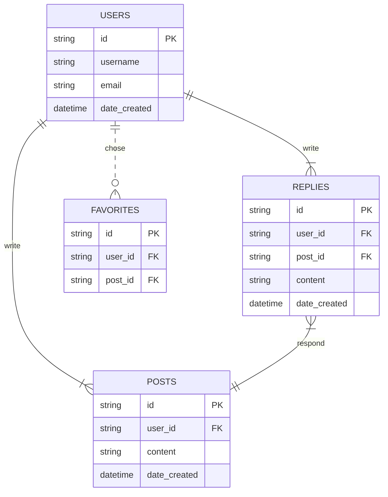

# testing_erd_mermaid_diagraming_on_github
Trying to see if the ERD (Entity Relationship Diagrams) portion of Mermaid works on GitHub.

Markup Used to Create Diagrams

| Value (left) | Value (right) | Meaning |
| :---: | :---: | :------------- |
| \|o | o\| | Zero or one |
| \|\| | \|\| | Exactly one |
| }o  | o{ | Zero or more (no upper limit) |
| }\|  | \|{ | One or more (no upper limit) 'Crowfoot'|

Keys can be PK, FK or UK, for Primary Key, Foreign Key or Unique Key. 
