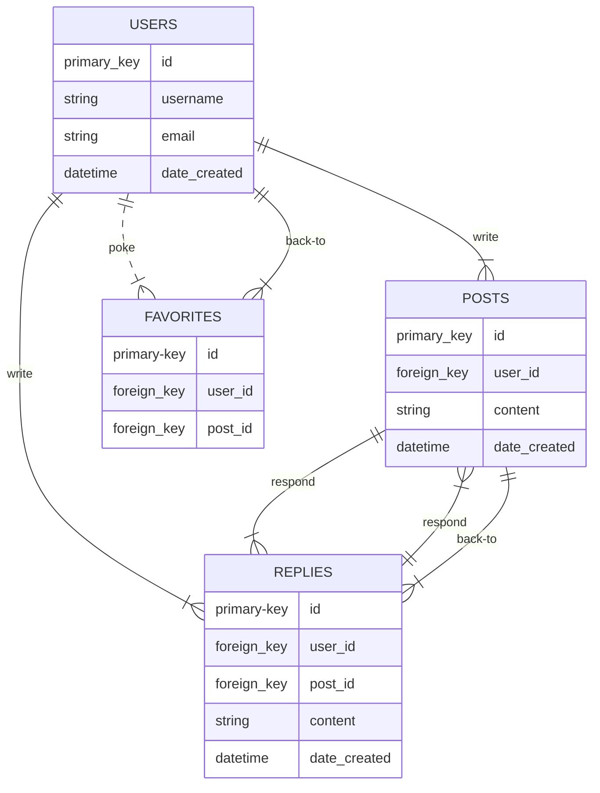

# testing_erd_mermaid_diagraming_on_github
Trying to see if the ERD (Entity Relationship Diagrams) portion of Mermaid works on GitHub.

```mermaid
erDiagram
    USERS ||--|{ POSTS : write
    USERS ||--|{ REPLIES: write
    USERS ||..|{ FAVORITES: poke
    USERS {
        primary_key id
        string username
        string email
        datetime date_created
    }
    POSTS ||--|{ REPLIES : respond
    REPLIES ||--|{ POSTS : respond
    POSTS {
        primary_key id
        foreign_key user_id
        string content
        datetime date_created
    }
    REPLIES |{--|| POSTS : back-to
    REPLIES {
        primary-key id
        foreign_key user_id
        foreign_key post_id
        string content
        datetime date_created
    }
    FAVORITES |{--|| USERS : back-to
    FAVORITES {
        primary-key id
        foreign_key user_id
        foreign_key post_id
    }
```
